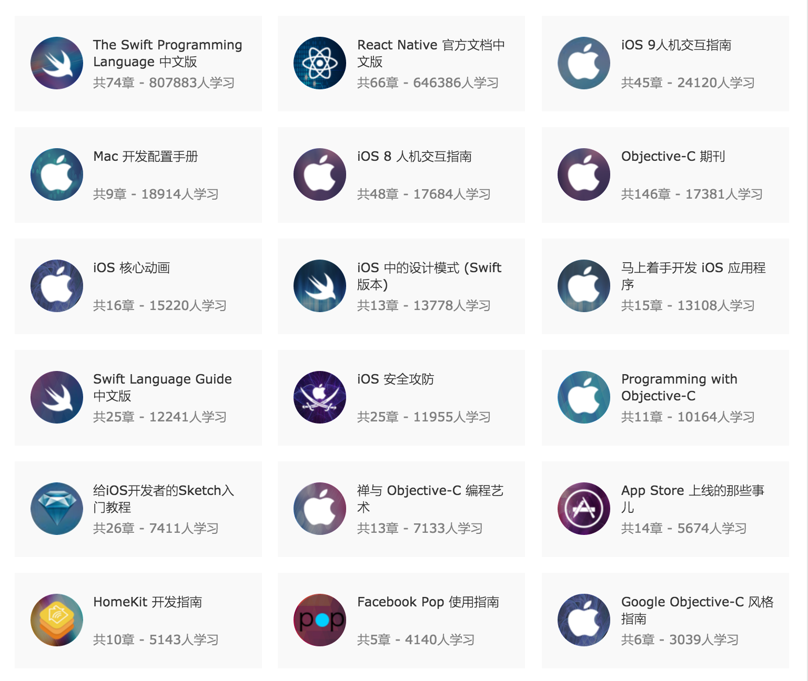
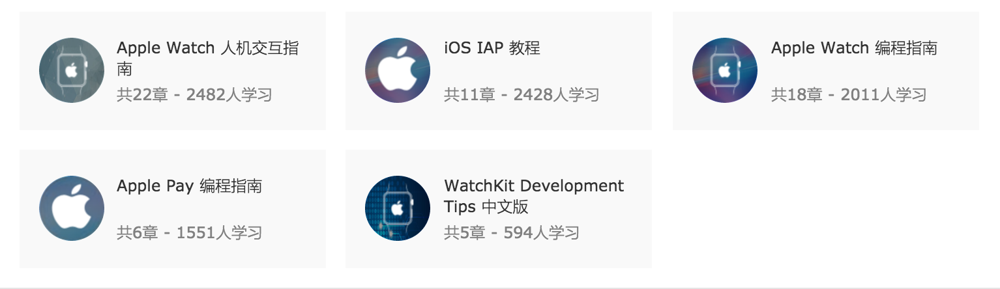

# 备忘录
***
## 一些教程的地址
1. 泊学: https://www.boxueio.com/skill/swift?v
2. Swift V 课堂： http://www.swiftv.cn/course/explore
3. 极客学院 Swift 2.0 中文版： http://wiki.jikexueyuan.com/project/swift/

**极客学院IOS开发各种教程：** http://wiki.jikexueyuan.com/list/ios/
目录如下：

